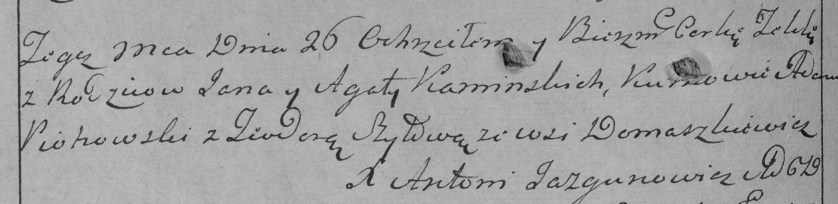

**Каминская Текля Янкова (Kaminska Tekla)**

26 сентября 1787 г -- крещение (НИАБ 136-13-894, лист 2об, №48/1787-р
(ориг)), (НИАБ 136-13-894, лист 2об, №48/1787-р (ориг)).

**НИАБ 136-13-894:** Лист 2об. **Метрическая запись №48/1787-р (ориг).**

{width="6.496527777777778in"
height="0.797230971128609in"}

Дедиловичская Покровская церковь. 26 сентября 1787 года. Метрическая
запись о крещении.

Kaminska Tekla - дочь родителей с деревни Домашковичи.

Kaminski Janka -- отец.

Kaminska Agata -- мать.

Piotrowski Adam - кум.

Szyłowa? Teodora - кума.

Jazgunowicz Antoni -- ксёндз.

**РГИА 823-2-18:** Лист 234об. **Метрическая запись №26/1787-р (коп).**

{width="6.496527777777778in"
height="1.58125in"}

Дедиловичская Покровская церковь. 26 сентября 1787 года. Метрическая
запись о крещении.

Kaminska Tekla -- дочь родителей с деревни Домашковичи.

Kaminski Jan -- отец.

Kaminska Agata -- мать.

Piotrowski Adam -- кум.

Szyłowa Teodora - кума.

Jazgunowicz Antoni -- ксёндз.
