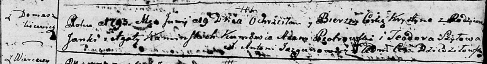
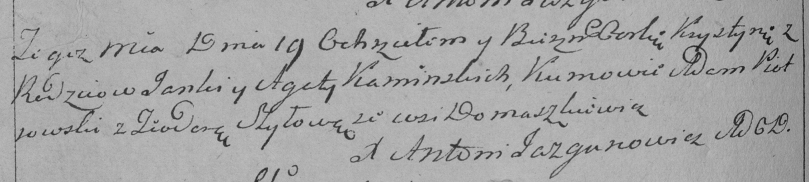

**Каминская Хрыстына Янкова (Kaminska Krystyna)**

19 июня 1793 г -- крещение (НИАБ 136-13-894, лист 20, №51/1793-р
(ориг)), (РГИА 823-2-18, лист 247об, №25/1793-р (коп)).

**НИАБ 136-13-894:** Лист 20. **Метрическая запись №51/1793-р (ориг).**

Дедиловичская Покровская церковь. 19 июня 1793 года. Метрическая запись
о крещении.

Kaminska Krystyna -- дочь родителей с деревни Домашковичи.

Kaminski Janka -- отец.

Kaminska Agata -- мать.

Piotrowski Adam - кум.

Szyłowa Teodora - кума.

Jazgunowicz Antoni -- ксёндз.

**РГИА 823-2-18:** Лист 247об. **Метрическая запись №25/1793-р (коп).**

Дедиловичская Покровская церковь. 19 июня 1793 года. Метрическая запись
о крещении.

Kaminska Krystyna -- дочь родителей с деревни Домашковичи.

Kaminski Janka -- отец.

Kaminska Agata -- мать.

Piotrowski Adam -- кум.

Szyłowa Teodora -- кума.

Jazgunowicz Antoni -- ксёндз.
