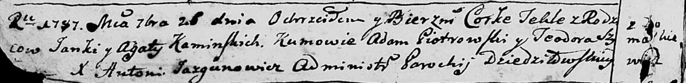
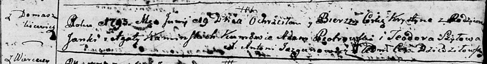
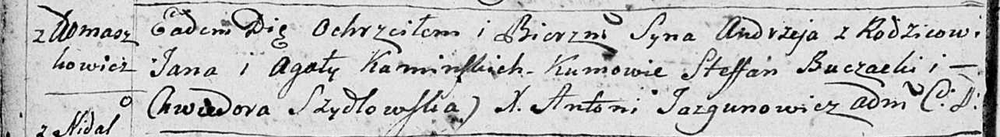

**Каминский Янка (Kaminski Janka, Jan)**

26 сентября 1787 г -- крещение дочери Текли (НИАБ 136-13-894, лист 2об,
№48/1787-р (ориг)), (НИАБ 136-13-894, лист 2об, №48/1787-р (ориг)).

19 июня 1793 г -- крещение дочери Хрыстыны (НИАБ 136-13-894, лист 20,
№51/1793-р (ориг)), (РГИА 823-2-18, лист 247об, №25/1793-р (коп)).

7 сентября 1796 г -- крещение сына Андрея (НИАБ 136-13-894, лист 30об,
№79/1796-р (ориг)).

**НИАБ 136-13-894:** Лист 2об. **Метрическая запись №48/1787-р (ориг).**

Дедиловичская Покровская церковь. 26 сентября 1787 года. Метрическая
запись о крещении.

Kaminska Tekla - дочь родителей с деревни Домашковичи.

Kaminski Janka -- отец.

Kaminska Agata -- мать.

Piotrowski Adam - кум.

Szyłowa? Teodora - кума.

Jazgunowicz Antoni -- ксёндз.

**РГИА 823-2-18:** Лист 234об. **Метрическая запись №26/1787-р (коп).**

Дедиловичская Покровская церковь. 26 сентября 1787 года. Метрическая
запись о крещении.

Kaminska Tekla -- дочь родителей с деревни Домашковичи.

Kaminski Jan -- отец.

Kaminska Agata -- мать.

Piotrowski Adam -- кум.

Szyłowa Teodora - кума.

Jazgunowicz Antoni -- ксёндз.

**НИАБ 136-13-894:** Лист 20. **Метрическая запись №51/1793-р (ориг).**

Дедиловичская Покровская церковь. 19 июня 1793 года. Метрическая запись
о крещении.

Kaminska Krystyna -- дочь родителей с деревни Домашковичи.

Kaminski Janka -- отец.

Kaminska Agata -- мать.

Piotrowski Adam - кум.

Szyłowa Teodora - кума.

Jazgunowicz Antoni -- ксёндз.

**РГИА 823-2-18:** Лист 247об. **Метрическая запись №25/1793-р (коп).**

Дедиловичская Покровская церковь. 19 июня 1793 года. Метрическая запись
о крещении.

Kaminska Krystyna -- дочь родителей с деревни Домашковичи.

Kaminski Janka -- отец.

Kaminska Agata -- мать.

Piotrowski Adam -- кум.

Szyłowa Teodora -- кума.

Jazgunowicz Antoni -- ксёндз.

**НИАБ 136-13-894:** Лист 30-об. **Метрическая запись №79/1796-р
(ориг).**

Дедиловичская Покровская церковь. 7 сентября 1796 года. Метрическая
запись о крещении.

Kaminski Andrzey-- сын родителей с деревни Домашковичи.

Kaminski Jan -- отец.

Kaminska Agata -- мать.

Buczocki Stefan - кум.

Szydłowska Chwiedora - кума.

Jazgunowicz Antoni -- ксёндз.
