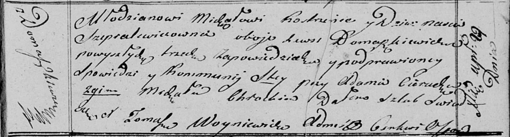

**Костренец Михал (Kostrenec Michał)**

29 апреля 1814 г -- венчание с девкой Настей Шапелевич с деревни
Домашковичи (НИАБ 136-13-920, лист 21, №3/1814-б (ориг)).

**НИАБ 136-13-920:** Лист 21. **Метрическая запись №3/1814-б (ориг).**

Осовская Покровская церковь. 29 апреля 1814 года. Запись о венчании.

Kostrzenec Michał -- жених, молодой, с деревни Домашковичи.

Szepialewiczowna Nascia -- невеста, девка, с деревни Домашковичи.

Cierach Adam -- свидетель.

Chrocki Michał -- свидетель.

Woyniewicz Tomasz -- ксёндз.
