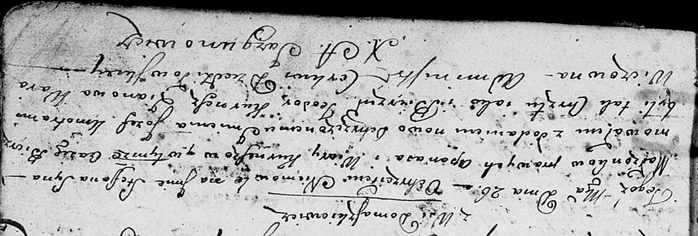

**Курнеш Степан Апанасов (Kurnesz Stefan Jozef)**

26 октября 1802 г -- крещение (НИАБ 136-13-894, лист 48, №38/1802-р
(ориг)).

**НИАБ 136-13-894:** Лист 48. **Метрическая запись №38/1802-р (ориг).**

{width="6.496527777777778in"
height="2.2086450131233595in"}

Дедиловичская Покровская церковь. 26 октября 1802 года. Метрическая
запись о крещении.

Kurnesz Stefan Jozef -- сын родителей с деревни Домашковичи.

Kurnesz Apanas -- отец.

Kurneszowa Wiara -- мать.

Kurnesz Teodor -- кум.

Warawiczowna Zianowia -- кума.

Jazgunowicz Antoni -- ксёндз.
