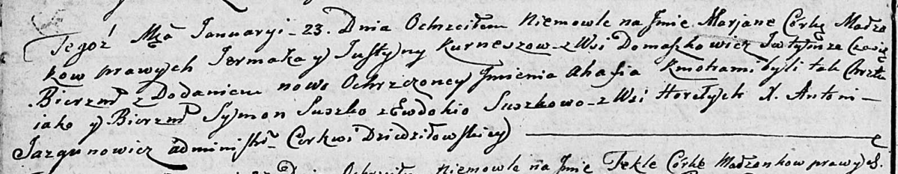

**Курнеш Юстына (Kurneszowa Justyna)**

23 января 1805 г -- крещение дочери Марьяны Агафии (НИАБ 136-13-894,
лист 56об, №8/1805-р (ориг)).

**НИАБ 136-13-894:** Лист 56об. **Метрическая запись №8/1805-р (ориг).**

{width="6.496527777777778in"
height="1.2612204724409448in"}

Дедиловичская Покровская церковь. 23 января 1805 года. Метрическая
запись о крещении.

Kurneszowna Marjana Ahafia -- дочь родителей с деревни Домашковичи.

Kurnesz Jermak -- отец.

Kurneszowa Justyna -- мать.

Suszko Symon -- кум.

Suszkowa Ewdokija -- кума, с деревни Горелое.

Jazgunowicz Antoni -- ксёндз.
