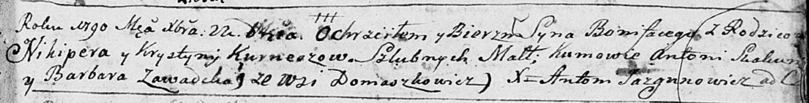
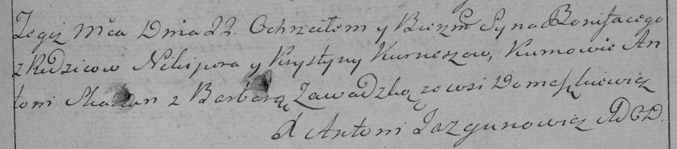

**Курнеш Бонифатий Никиперов (Kurnesz Bonifaty)**

22 декабря 1790 г -- крещение (НИАБ 136-13-894, лист 12, №89/1790-р
(ориг)) (РГИА 823-2-18, лист 241, №35/1790-р (коп)).

**НИАБ 136-13-894:** Лист 12. **Метрическая запись №89/1790-р (ориг).**

Дедиловичская Покровская церковь. 22 декабря 1790 года. Метрическая
запись о крещении.

Kurnesz Bonifaty -- сын родителей с деревни Домашковичи.

Kurnesz Nikiper -- отец.

Kurneszowa Krystyna -- мать.

Skakun Antoni - кум.

Zawadcka Barbara - кума.

Jazgunowicz Antoni -- ксёндз.

**РГИА 823-2-18:** Лист 241. **Метрическая запись №35/1790-р (коп).**

Дедиловичская Покровская церковь. 22 декабря 1790 года. Метрическая
запись о крещении.

Kurnesz Bonifacy -- сын родителей с деревни Домашковичи.

Kurnesz Nikiper -- отец.

Kurneszowa Krystyna -- мать.

Skakun Antoni -- кум.

Zawadzka Barbara - кума.

Jazgunowicz Antoni -- ксёндз.
