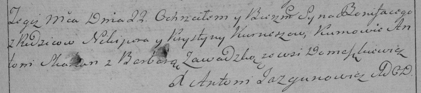

**Курнеш Хрыстына (Kurneszowa Krystyna)**

18 апреля 1787 г -- крещение сына Яна (НИАБ 136-13-894, лист 1об,
№15/1787-р (ориг)), (РГИА 823-2-18, лист 233об, №11/1787-р (коп)).

22 декабря 1790 г -- крещение сына Бонифатий (НИАБ 136-13-894, лист 12,
№89/1790-р (ориг)) (РГИА 823-2-18, лист 241, №35/1790-р (коп)).

**НИАБ 136-13-894:** Лист 1об. **Метрическая запись №15/1787-р (ориг).**

{width="6.496527777777778in"
height="0.8508716097987752in"}

Дедиловичская Покровская церковь. 18 апреля 1787 года. Метрическая
запись о крещении.

Kurnesz Jan -- сын родителей с деревни Домашковичи.

Kurnesz Nikiper -- отец.

Kurneszowa Krystyna -- мать.

Skakun Antoni - кум.

Hłuszniowa Palanieja - кума.

Jazgunowicz Antoniusz -- ксёндз.

**РГИА 823-2-18:** Лист 233об. **Метрическая запись №11/1787-р (коп).**

{width="6.496527777777778in"
height="1.6805555555555556in"}

Дедиловичская Покровская церковь. 30 апреля 1787 года. Метрическая
запись о крещении.

Kurnesz Jan -- сын родителей с деревни \[Домашковичи\].

Kurnesz Nikiper -- отец.

Kurneszowa Krystyna -- мать.

Skakun Anton -- кум.

Hłuszniowa Pałanieja - кума.

Jazgunowicz Antoni -- ксёндз.

**НИАБ 136-13-894:** Лист 12. **Метрическая запись №89/1790-р (ориг).**

{width="6.496527777777778in"
height="0.8361198600174978in"}

Дедиловичская Покровская церковь. 22 декабря 1790 года. Метрическая
запись о крещении.

Kurnesz Bonifaty -- сын родителей с деревни Домашковичи.

Kurnesz Nikiper -- отец.

Kurneszowa Krystyna -- мать.

Skakun Antoni - кум.

Zawadcka Barbara - кума.

Jazgunowicz Antoni -- ксёндз.

**РГИА 823-2-18:** Лист 241. **Метрическая запись №35/1790-р (коп).**

{width="6.496527777777778in"
height="1.4354166666666666in"}

Дедиловичская Покровская церковь. 22 декабря 1790 года. Метрическая
запись о крещении.

Kurnesz Bonifacy -- сын родителей с деревни Домашковичи.

Kurnesz Nikiper -- отец.

Kurneszowa Krystyna -- мать.

Skakun Antoni -- кум.

Zawadzka Barbara - кума.

Jazgunowicz Antoni -- ксёндз.
