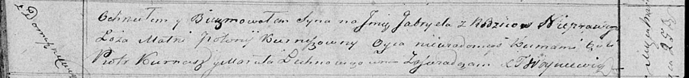

**Габриэль (Gabriel)**

25 марта 1819 г -- крещение (НИАБ 136-13-894, лист 100об, №15/1819-р
(ориг)).

**НИАБ 136-13-894:** Лист 100об. **Метрическая запись №15/1819-р
(ориг).**

Осовская Покровская церковь. 25 марта 1819 года. Метрическая запись о
крещении.

Gabriel -- незаконнорожденный сын с деревни Домашковичи.

Kurneszowna Połonia -- мать.

Kurnesz Piotr -- кум.

Lechnowczowna Maruta -- кума.

Woyniewicz Tomasz -- ксёндз.
