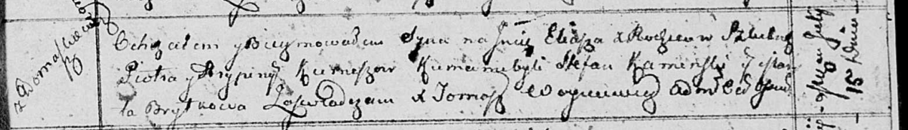

**Курнеш Илья Петров (Kurnesz Eliasz)**

15 июля 1813 г -- крещение (НИАБ 136-13-894, лист 87, №19/1813-р
(ориг)).

**НИАБ 136-13-894:** Лист 87. **Метрическая запись №19/1813-р (ориг).**

{width="6.496527777777778in"
height="0.9380369641294838in"}

Осовская Покровская церковь. 15 июля 1813 года. Метрическая запись о
крещении.

Kurnesz Eliasz -- сын родителей с деревни Домашковичи.

Kurnesz Piotr -- отец.

Kurneszowa Hrypina -- мать.

Kaminski Stefan -- кум.

Brytkowa Maryla -- кума.

Woyniewicz Tomasz -- ксёндз.
