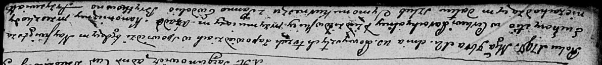
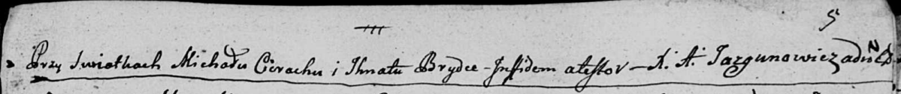
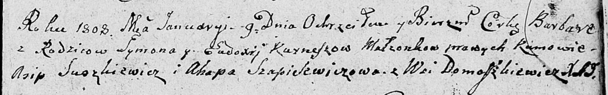

**Курнеш Сымон (Kurnesz Symon)**

12 ноября 1797 г -- венчание с Евдокией Брытко (НИАБ 136-13-920, лист
4об-5, №12/1797-б (ориг)).

9 января 1808 г -- крещение дочери Варвары (НИАБ 136-13-894, лист 64,
№2/1808-р (ориг)).

**НИАБ 136-13-920:** Лист 4об-5. **Метрическая запись №12/1797-б
(ориг).**

Дедиловичская Покровская церковь. 12 ноября 1797 года. Метрическая
запись о венчании.

Kurnesz Symon -- жених с деревни \[Домашковичи\].

Brytkowna Ewdokia -- невеста.

Cierach Michał -- свидетель.

Brytka Jhnat -- свидетель.

Jazgunowicz Antoni -- ксёндз.

**НИАБ 136-13-894:** Лист 64. **Метрическая запись №2/1808-р (ориг).**

Дедиловичская Покровская церковь. 9 января 1808 года. Метрическая запись
о крещении.

Kurneszowa Barbara -- дочь родителей с деревни Домашковичи.

Kurnesz Symon -- отец.

Kurneszowa Eudoxija -- мать.

Suszkiewicz Asip -- кум.

Szapielewiczowa Ahapa -- кума.

Jazgunowicz Antoni -- ксёндз.
