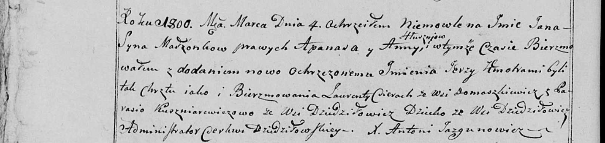

**Кушнеревич Парася (Kuszniarewiczowa Parasia)**

4 марта 1800 г -- крестная мать Яна Ежы, сына Глушней Апанаса и Анны с
деревни Дедиловичи (НИАБ 136-13-894, лист 41, №9/1800-р (ориг), НИАБ
136-13-949, лист 101об, №9/1800-р (коп)).

**НИАБ 136-13-894:** Лист 41. **Метрическая запись №9/1800-р (ориг).**

{width="6.496527777777778in"
height="1.658830927384077in"}

Дедиловичская Покровская церковь. 4 марта 1800 года. Метрическая запись
о крещении.

Hłuszeń Jan Jerzy -- сын родителей с деревни Дедиловичи.

Hłuszeń Apanas -- отец.

Hłuszniowa Anna -- мать.

Cierach Lawrenty -- кум, с деревни Домашковичи.

Kuszniarowiczowa Parasia -- кума, с деревни Домашковичи.

Jazgunowicz Antoni -- ксёндз.

**НИАБ 136-13-949:** Лист 101об. **Метрическая запись №9/1800-р (коп).**

(См. тж.: РГИА 823-2-18, лист 274об, №9/1800-р (коп), НИАБ 136-13-894,
лист 41, №9/1800-р (ориг))

{width="6.496527777777778in"
height="1.5458333333333334in"}

Дедиловичская Покровская церковь. 4 марта 1800 года. Метрическая запись
о крещении.

Hłuszeń Jan Jerzy -- сын родителей с деревни Дедиловичи.

Hłuszeń Apanas -- отец.

Hłuszniowa Anna -- мать.

Cierac Łaurenty -- кум, с деревни Домашковичи.

Kuszniarewiczowa Parasia - кума, с деревни Дедиловичи \[Домашковичи\].

Jazgunowicz Antoni -- ксёндз.
