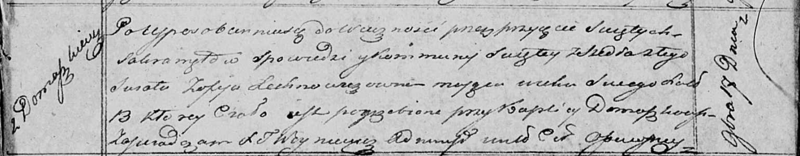

**Лехнович София (Lechnowiczowna Zofija)**

17 ноября 1821 г -- отпевание, умерла в возрасте 13 лет (родилась около
1808 г) (НИАБ 136-13-919, лист 35, №13/1821-у (ориг).

**НИАБ 136-13-919:** Лист 35. **Метрическая запись №13/1821-у (ориг).**

{width="6.496527777777778in"
height="1.2743055555555556in"}

Осовская униатская церковь. 17 ноября 1821 года. Метрическая запись об
отпевании.

Lechnowiczowna Zofija -- умершая, 13 лет, с деревни Домашковичи,
похоронена при каплице Домашковичской.

Woyniewicz Tomasz -- ксёндз.
