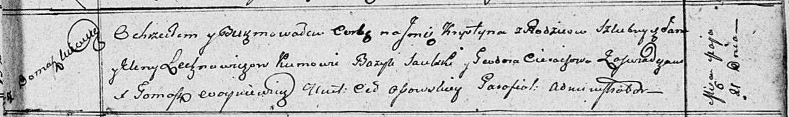

**Лехнович Елена (Lechnowiczowa, Elichnowiczowa, Olechnowiczowa Elena)**

26 июня 1808 г -- крещение дочери Юстины (НИАБ 937-4-32, лист 18об,
№18/1808-р.

21 мая 1811 г -- крещение дочери Крыстыны (НИАБ 136-13-894, лист 81,
№25/1811-р (ориг).

10 мая 1814 г -- крещение сына Феликса (НИАБ 136-13-894, лист 89об,
№28/1814-р (ориг).

**НИАБ 937-4-32:** Лист 18об. **Метрическая запись №18/1808-р.**

Дедиловичский костел Наисвятейшего Сердца Иисуса. 26 июня 1808 года.
Метрическая запись о крещении.

Olechnowiczowna Justina -- дочь крестьян с деревни Домашковичи.

Olechnowicz Joann -- отец.

Olechnowiczowa Helena -- мать.

Saulski? Basili -- крестный отец.

Cierachowa Praxeda -- крестная мать.

Scindzelewski Andreas -- ксёндз, комендант Дедиловичский.

**НИАБ 136-13-894:** Лист 81. **Метрическая запись №25/1811-р (ориг).**

Осовская Покровская церковь. 21 мая 1811 года. Метрическая запись о
крещении.

Lechnowiczowna Krystyna -- дочь родителей с деревни Домашковичи.

Lechnowicz Jan -- отец.

Lechnowiczowa Elena -- мать.

Saulski Bazyl -- кум.

Cierachowa Teodora -- кума.

Woyniewicz Tomasz -- ксёндз.

**НИАБ 136-13-894:** Лист 89об. **Метрическая запись №28/1814-р
(ориг).**

Осовская Покровская церковь. 10 мая 1814 года. Метрическая запись о
крещении.

Elichnowicz Felix -- сын родителей с деревни Домашковичи.

Elichnowicz Jan -- отец.

Elichnowiczowa Elena -- мать.

Jwanowski Tadeusz, JP -- кум, шляхтич.

Burdzilowska Lucija -- кума.

Saulski Franciszek, JP -- ассистент, шляхтич.

Cierachowa Teodora -- ассистентка.

Woyniewicz Tomasz -- ксёндз.
