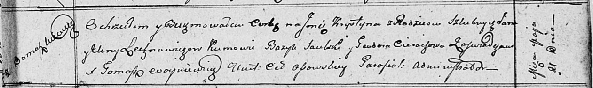

**Лехнович Крыстына Янова (Lechnowiczowna Krystyna)**

21 мая 1811 г -- крещение (НИАБ 136-13-894, лист 81, №25/1811-р (ориг).

**НИАБ 136-13-894:** Лист 81. **Метрическая запись №25/1811-р (ориг).**

Осовская Покровская церковь. 21 мая 1811 года. Метрическая запись о
крещении.

Lechnowiczowna Krystyna -- дочь родителей с деревни Домашковичи.

Lechnowicz Jan -- отец.

Lechnowiczowa Elena -- мать.

Saulski Bazyl -- кум.

Cierachowa Teodora -- кума.

Woyniewicz Tomasz -- ксёндз.
