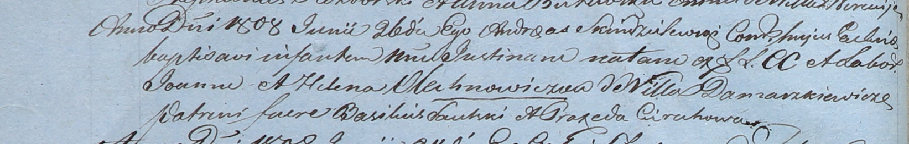

**Лехнович Юстина Янова (Olechnowiczowna Justina)**

26 июня 1808 г -- крещение дочери Юстины (НИАБ 937-4-32, лист 18об,
№18/1808-р.

**НИАБ 937-4-32:** Лист 18об. **Метрическая запись №18/1808-р.**

Дедиловичский костел Наисвятейшего Сердца Иисуса. 26 июня 1808 года.
Метрическая запись о крещении.

Olechnowiczowna Justina -- дочь крестьян с деревни Домашковичи.

Olechnowicz Joann -- отец.

Olechnowiczowa Helena -- мать.

Saulski? Basili -- крестный отец.

Cierachowa Praxeda -- крестная мать.

Scindzelewski Andreas -- ксёндз, комендант Дедиловичский.
