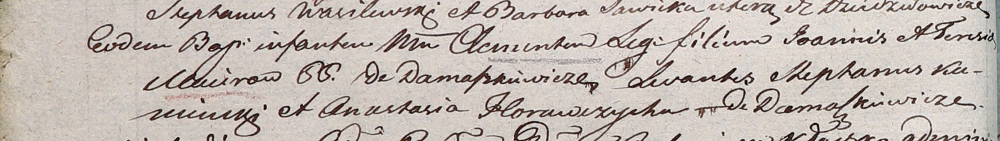

**Мациро Клементий Иоаннов (Maciro Clementis)**

21 ноября 1804 г -- крещение (НИАБ 937-4-32, лист 10об, №24/1804-р).

**НИАБ 937-4-32:** Лист 10об. **Метрическая запись №24/1804-р.**

Дедиловичский костел Наисвятейшего Сердца Иисуса. 21 ноября 1804 года.
Метрическая запись о крещении.

Maciro Clementis -- сын крестьян с деревни Домашковичи.

Maciro Joann -- отец.

Macirowao Teresia -- мать.

Kaminski Stephan -- крестный отец.

Horauczycha Anastasia -- крестная мать, с деревни Домашковичи.

Galinowski Joann -- ксёндз, комендант Дедиловичского костела.
