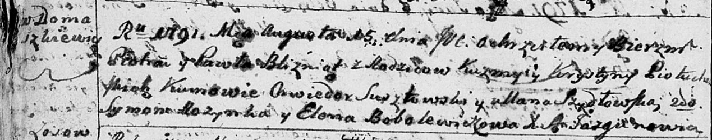
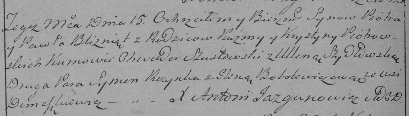
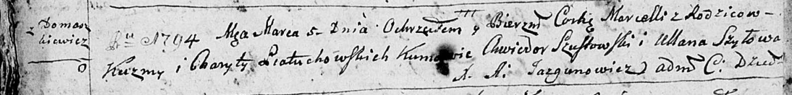

**Петуховский Кузьма (Piotuchowski Kuzma)**

15 августа 1791 г -- крещение сыновей близнецов Петра и Павла (НИАБ
136-13-894, лист 13об, №37/1791-р (ориг)), (РГИА 823-2-18, лист 242,
№18/1791-р (коп)).

5 марта 1794 г -- крещение дочери Марцеллы (НИАБ 136-13-894, лист 21об,
№13/1794-р (ориг)).

**НИАБ 136-13-894:** Лист 13об. **Метрическая запись №37/1791-р
(ориг).**

Дедиловичская Покровская церковь. 15 августа 1791 года. Метрическая
запись о крещении.

Piotuchowski Piotr, Piotuchowski Paweł -- сыновья родителей близнецы с
деревни Домашковичи.

Piotuchowski Kuzma -- отец.

Piotuchowska Krystyna -- мать.

Susztowski Chwiedor - кум.

Szydłowska Ullana - кума.

Rozynka Symon - кум.

Bobolewiczowa Elena - кума.

Jazgunowicz Antoni -- ксёндз.

**РГИА 823-2-18:** Лист 242об. **Метрическая запись №18/1791-р (коп).**

Дедиловичская Покровская церковь. 15 августа 1791 года. Метрическая
запись о крещении.

Piotrowski \[Piotuchowski\] Piotr -- сын родителей с деревни
Домашковичи.

Piotrowski \[Piotuchowski\] Paweł -- сын родителей с деревни
Домашковичи.

Piotrowski \[Piotuchowski\] Kużma -- отец.

Piotrowska \[Piotuchowska\] Krystyna -- мать.

Szustowski Chwiedor -- кум.

Szydłowska Ullana - кума.

Rozynko Symon -- кум.

Bobolewiczowa Elena - кума.

Jazgunowicz Antoni -- ксёндз.

**НИАБ 136-13-894:** Лист 21-об. **Метрическая запись №13/1794-р
(ориг).**

Дедиловичская Покровская церковь. 5 марта 1794 года. Метрическая запись
о крещении.

Piotuchowska Marcella -- дочь родителей с деревни Домашковичи.

Piotuchowski Kuzma -- отец.

Piotuchowska Charyta -- мать.

Szustowski Chwiedor - кум.

Szyłowa Ullana - кума.

Jazgunowicz Antoni -- ксёндз.
