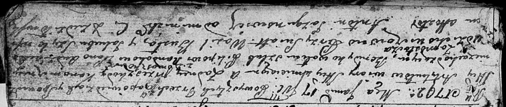

**Рандак Пилип (Randak Pilip)**

17 января 1792 г -- венчание с Авдюхой Авдюхович с деревни Замосточье
(НИАБ 136-13-894, лист 70, №1/1792-р (ориг)).

**НИАБ 136-13-894:** Лист 70. **Метрическая запись №1/1792-б (ориг).**

Дедиловичская Покровская церковь. 17 января 1792 года. Метрическая
запись о венчании.

Randak Pilip -- жених, с деревни Домашковичи.

Audziechowiczewa Audziucha -- невеста, с деревни Замосточье.

Busła Wasil -- свидетель.

Szyło Jakub -- свидетель.

Jazgunowicz Antoni -- ксёндз.
