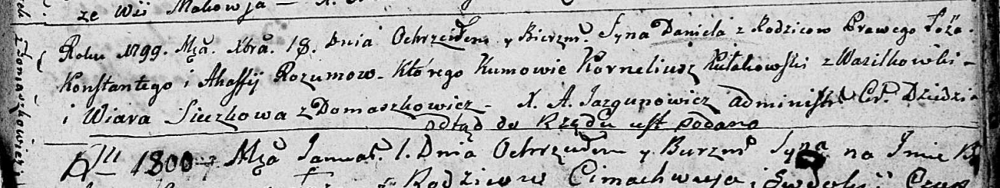
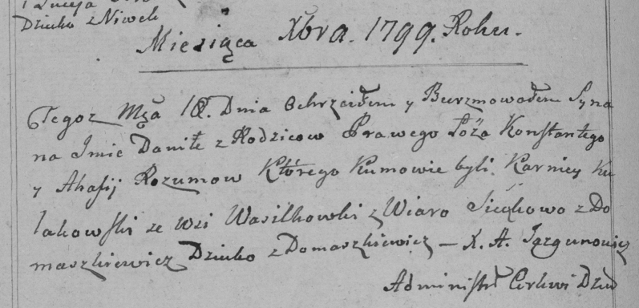

**Розум Даниэль Константиев (Rozum Daniel)**

18 декабря 1799 г -- крещение (НИАБ 136-13-894, лист 40, №52/1799-р
(ориг), РГИА 823-2-18, лист 273об, №51/1799-р (коп), НИАБ 136-13-938,
лист 245об, №47/1799-р (коп)).

**НИАБ 136-13-894:** Лист 40. **Метрическая запись №52/1799-р (ориг).**

Дедиловичская Покровская церковь. 18 декабря 1799 года. Метрическая
запись о крещении.

Rozum Daniel -- сын родителей с деревни Домашковичи.

Rozum Konstanty -- отец.

Rozumowa Ahafija -- мать.

Kułakowski Korneliusz -- кум, с деревни Васильковка.

Sieczkowa Wiara -- кума, с деревни Домашковичи.

Jazgunowicz Antoni -- ксёндз.

**РГИА 823-2-18:** Лист 273об. **Метрическая запись №51/1799-р (коп).**

Дедиловичская Покровская церковь. 18 декабря 1799 года. Метрическая
запись о крещении.

Rozum Daniło -- сын родителей с деревни Домашковичи.

Rozum Konstanty \[Kondraty\] -- отец.

Rozumowa Ahafija -- мать.

Kułakowski Karniey -- кум, с деревни Домашковичи.

Sieczkowa Wiara -- кума, с деревни Домашковичи.

Jazgunowicz Antoni -- ксёндз.

**НИАБ 136-13-938:** Лист 245об. **Метрическая запись №47/1799-р
(коп).**

(См. тж. НИАБ 136-13-894, лист 40, №52/1799-р (ориг); РГИА 823-2-18,
лист 273об, №51/1799-р (коп))

Дедиловичская Покровская церковь. 18 декабря 1799 года. Метрическая
запись о крещении.

Rozum Daniel Jozef -- сын родителей с деревни Домашковичи.

Rozum Konstanty \[Kondraty\] -- отец.

Rozumowa Ahafia -- мать.

Kułakowski Karniey \[Korneliusz\] -- кум, с деревни Васильковка.

Sieczkowa Wiera \[Suszkowa Wiara\] - кума, с деревни Домашковичи.

Jazgunowicz Antoni -- ксёндз.
