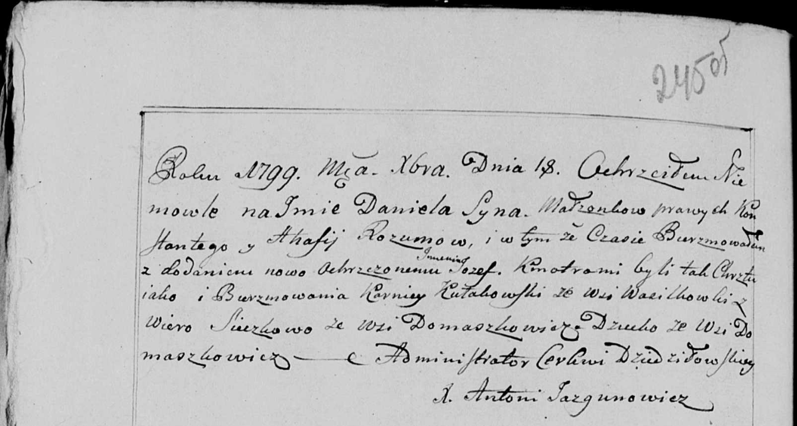

**Розум Константы (Rozum Konstanty)**

18 декабря 1799 г -- крещение сына Даниеля (НИАБ 136-13-894, лист 40,
№52/1799-р (ориг), РГИА 823-2-18, лист 273об, №51/1799-р (коп), НИАБ
136-13-938, лист 245об, №47/1799-р (коп)).

2 июня 1801 г -- крещение сына Григора (НИАБ 937-4-32, лист 4об,
№12/1800-р).

**НИАБ 136-13-894:** Лист 40. **Метрическая запись №52/1799-р (ориг).**

{width="6.496527777777778in"
height="1.224342738407699in"}

Дедиловичская Покровская церковь. 18 декабря 1799 года. Метрическая
запись о крещении.

Rozum Daniel -- сын родителей с деревни Домашковичи.

Rozum Konstanty -- отец.

Rozumowa Ahafija -- мать.

Kułakowski Korneliusz -- кум, с деревни Васильковка.

Sieczkowa Wiara -- кума, с деревни Домашковичи.

Jazgunowicz Antoni -- ксёндз.

**РГИА 823-2-18:** Лист 273об. **Метрическая запись №51/1799-р (коп).**

{width="6.496527777777778in"
height="3.129861111111111in"}

Дедиловичская Покровская церковь. 18 декабря 1799 года. Метрическая
запись о крещении.

Rozum Daniło -- сын родителей с деревни Домашковичи.

Rozum Konstanty -- отец.

Rozumowa Ahafija -- мать.

Kułakowski Karniey -- кум, с деревни Домашковичи.

Sieczkowa Wiara -- кума, с деревни Домашковичи.

Jazgunowicz Antoni -- ксёндз.

**НИАБ 136-13-938:** Лист 245об. **Метрическая запись №47/1799-р
(коп).**

(См. тж. НИАБ 136-13-894, лист 40, №52/1799-р (ориг); РГИА 823-2-18,
лист 273об, №51/1799-р (коп))

{width="6.496527777777778in"
height="3.4722222222222223in"}

Дедиловичская Покровская церковь. 18 декабря 1799 года. Метрическая
запись о крещении.

Rozum Daniel Jozef -- сын родителей с деревни Домашковичи.

Rozum Konstanty -- отец.

Rozumowa Ahafia -- мать.

Kułakowski Karniey \[Korneliusz\] -- кум, с деревни Васильковка.

Sieczkowa Wiera \[Suszkowa Wiara\] - кума, с деревни Домашковичи.

Jazgunowicz Antoni -- ксёндз.

**НИАБ 937-4-32:** Лист 4об. **Метрическая запись №12/1801-р.**

{width="6.496527777777778in"
height="0.7486111111111111in"}

Дедиловичский костел Наисвятейшего Сердца Иисуса. 2 июня 1801 года.
Метрическая запись о крещении.

Rozum Gregori -- сын родителей с деревни Домашковичи.

Rozum Castus -- отец.

Rozumowa Hapa -- мать.

Kułakowski Carniey -- крестный отец, с деревни Васильковка.

Sieczkowa? Wiara -- крестная мать, с деревни Домашковичи.

Linhart Hyacinthus -- ксёндз.
