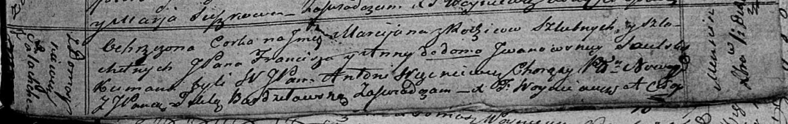

**Саульская Марцияна Францишкова, шляхтянка (Saulska Marcijana)**

1 декабря 1819 г -- крещение (НИАБ 136-13-894, лист 103, №62/1819-р
(ориг)).

**НИАБ 136-13-894:** Лист 103. **Метрическая запись №62/1819-р (ориг).**

Осовская Покровская церковь. 1 декабря 1819 года. Метрическая запись о
крещении.

Saulska Marcijana, JP -- дочь родителей с деревни Домашковичи,
шляхтянка.

Saulski Franciszek, JP -- отец, шляхтич.

Saulska z Jwanowskich Anna,JP -- мать, шляхтянка.

Węckiewicz Antoni, WJP -- кум, шляхтич, хорунжий.

Burdziłowska Tekla, JP -- кума, шляхтянка.

Woyniewicz Tomasz -- ксёндз.
