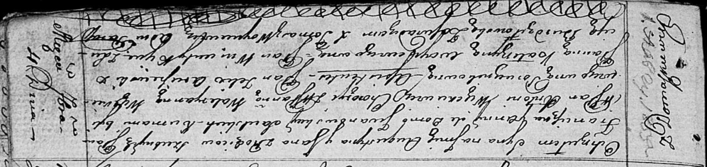

**Саульский Августын Францишков, шляхтич (Saulski Augustyn Jan)**

4 сентября 1816 г -- крещение (НИАБ 136-13-894, лист 94, №28/1816-р
(ориг)).

**НИАБ 136-13-894:** Лист 94. **Метрическая запись №28/1816-р (ориг).**

Осовская Покровская церковь. 4 сентября 1816 года. Метрическая запись о
крещении.

Saulski Augustyn Jan, JP -- сын родителей с деревни Домашковичи,
шляхтич.

Saulski Franciszek, JP -- отец, шляхтич.

Saulska z Jwanowskich Anna, JP -- мать, шляхтянка.

Więckiewicz Antoni, JP -- кум, хорунжий, шляхтич.

Więckiewiczowna Waleryanna, JP -- кума, шляхтянка.

Arciszewski Felix, JP -- ассистент, шляхтич.

Woyniewiczowna Katerzyna, JP -- ассистентка, шляхтянка.

Kijuc? Wincenty, JP -- ассистент, шляхтич.

Burdzilowska Lucija -- кума, ассистентка.

Woyniewicz Tomasz -- ксёндз.
