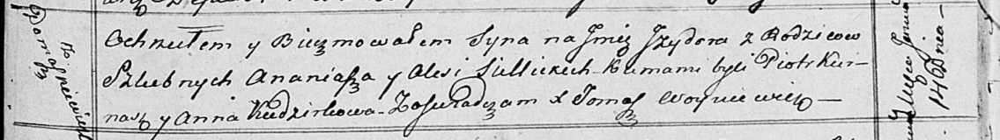

**Селицкая Алеся (Siellicka Alesia)**

30 марта 1814 г -- крещение сына Аляксея (НИАБ 136-13-894, лист 89,
№20/1814-р (ориг)).

14 января 1817 г -- крещение сына Изыдора (НИАБ 136-13-894, лист 95,
№3/1817-р (ориг)).

15 августа 1821 г -- крещение сына Стефана (НИАБ 136-13-894, лист 107,
№37/1821-р (ориг)).

**НИАБ 136-13-894:** Лист 89. **Метрическая запись №20/1814-р (ориг).**

Осовская Покровская церковь. 30 марта 1814 года. Метрическая запись о
крещении.

Siellicki Alaxiey -- сын родителей с деревни Домашковичи.

Siellicki Annaniasz -- отец.

Siellicka Alesia -- мать.

Kunesz Piotr -- кум.

Szyłowa Anna -- кума.

Woyniewicz Tomasz -- ксёндз.

**НИАБ 136-13-894:** Лист 95. **Метрическая запись №3/1817-р (ориг).**

Осовская Покровская церковь. 14 января 1817 года. Метрическая запись о
крещении.

Siellicki Jzydor -- сын родителей с деревни Домашковичи.

Siellicki Ananiasz -- отец.

Siellicka Alesia -- мать.

Kurnasz Piotr -- кум.

Kudzirkowa Anna -- кума.

Woyniewicz Tomasz -- ксёндз.

**НИАБ 136-13-894:** Лист 107. **Метрическая запись №37/1821-р (ориг).**

Осовская Покровская церковь. 15 августа 1821 года. Метрическая запись о
крещении.

Siellicki Stefan -- сын родителей с деревни Домашковичи.

Siellicki Ananiasz -- отец.

Siellicka Alesia -- мать.

Kurnasz Piotr -- кум.

Szyłowa Anna -- кума.

Woyniewicz Tomasz -- ксёндз.
