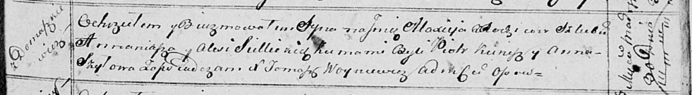

**Селицкий Аляксей Ананьев (Siellicki Alaxiey)**

30 марта 1814 г -- крещение (НИАБ 136-13-894, лист 89, №20/1814-р
(ориг)).

**НИАБ 136-13-894:** Лист 89. **Метрическая запись №20/1814-р (ориг).**

{width="6.496527777777778in"
height="0.900488845144357in"}

Осовская Покровская церковь. 30 марта 1814 года. Метрическая запись о
крещении.

Siellicki Alaxiey -- сын родителей с деревни Домашковичи.

Siellicki Annaniasz -- отец.

Siellicka Alesia -- мать.

Kunesz Piotr -- кум.

Szyłowa Anna -- кума.

Woyniewicz Tomasz -- ксёндз.
