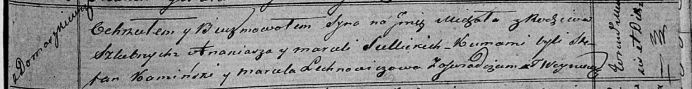

**Селицкий Ананий (Siellicki Ananiasz)**

12 ноября 1819 г -- крещение сына Михала (НИАБ 136-13-894, лист 103,
№59/1819-р (ориг)).

**НИАБ 136-13-894:** Лист 103. **Метрическая запись №59/1819-р (ориг).**

Осовская Покровская церковь. 12 ноября 1819 года. Метрическая запись о
крещении.

Siellicki Michał -- сын родителей с деревни Домашковичи.

Siellicki Ananiasz -- отец.

Siellicka Marcela -- мать.

Kaminski Stefan -- кум.

Lechnowiczowa Marcela -- кума.

Woyniewicz Tomasz -- ксёндз.
