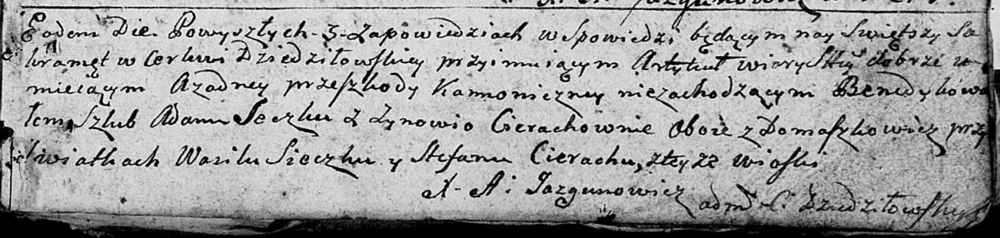

**Сечко Адам (Sieczka Adam)**

7 октября 1792 г -- венчание с Зыновией Церах с деревни Домашковичи
(НИАБ 136-13-894, лист 71, №17/1792-б (ориг)).

**НИАБ 136-13-894:** Лист 71. **Метрическая запись №17/1792-б (ориг).**

Дедиловичская Покровская церковь. 7 октября 1792 года. Метрическая
запись о венчании.

Sieczka Adam -- жених, с деревни Домашковичи.

Cierachowna Zynowija -- невеста, с деревни Домашковичи.

Sieczka Wasil -- свидетель.

Cierach Stefan -- свидетель, с деревни Домашковичи.

Jazgunowicz Antoni -- ксёндз.
