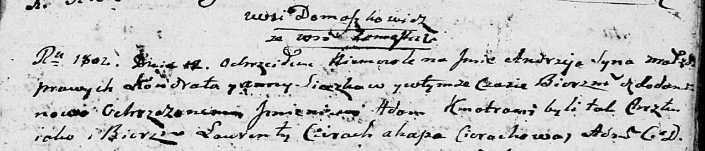

**Сечко Анна (Sieczkowa Anna)**

12 октября 1802 г -- крещение сына Андрея Адама (НИАБ 136-13-894, лист
48, №35/1802-р (ориг)).

**НИАБ 136-13-894:** Лист 48. **Метрическая запись №35/1802-р (ориг).**

Дедиловичская Покровская церковь. 12 октября 1802 года. Метрическая
запись о крещении.

Sieczko Andrzey Adam -- сын родителей с деревни Домашковичи.

Sieczko Kondrat -- отец.

Sieczkowa Anna -- мать.

Cierach Ławrenty -- кум.

Cierachowa Ahapa -- кума.

Jazgunowicz Antoni -- ксёндз, проводивший таинства, администратор
Дедиловичской церкви.
