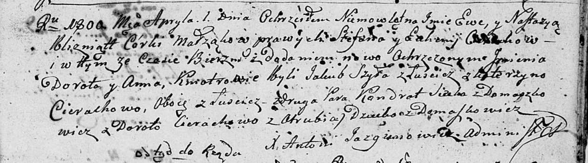

**Сечко Кондрат (Siczko, Sieczko Kondrat)**

1 апреля 1800 г -- крестный отец Настасьи Анны, дочери Церахов Степана и
Евгении с деревни Домашковичи (НИАБ 136-13-894, лист 41, №12/1800-р
(ориг)).

12 октября 1802 г -- крещение сына Андрея Адама (НИАБ 136-13-894, лист
48, №35/1802-р (ориг)).

**НИАБ 136-13-894:** Лист 41. **Метрическая запись №12/1800-р (ориг).**

Дедиловичская Покровская церковь. 1 апреля 1800 года. Метрическая запись
о крещении.

Cierachowna Ewa Dorota -- близнец, дочь родителей с деревни Домашковичи.

Cierachowna Nastazyja Anna -- близнец, дочь родителей с деревни
Домашковичи.

Cierach Stefan -- отец.

Cierachowa Euhenija -- мать.

Szyło Jakub -- кум, крестный отец Евы Дороты, с деревни Лустичи.

Cierachowa Katerzyna -- кума, крестная мать Евы Дороты, с деревни
Лустичи.

Siczko? Kondrat -- кум, крестный отец Настасьи Анны, с деревни
Домашковичи.

Cierachowa Dorota -- кума, крестная мать Настасьи Анны, с деревни Отруб.

Jazgunowicz Antoni -- ксёндз.

**НИАБ 136-13-894:** Лист 48. **Метрическая запись №35/1802-р (ориг).**

Дедиловичская Покровская церковь. 12 октября 1802 года. Метрическая
запись о крещении.

Sieczko Andrzey Adam -- сын родителей с деревни Домашковичи.

Sieczko Kondrat -- отец.

Sieczkowa Anna -- мать.

Cierach Ławrenty -- кум.

Cierachowa Ahapa -- кума.

Jazgunowicz Antoni -- ксёндз, проводивший таинства, администратор
Дедиловичской церкви.
