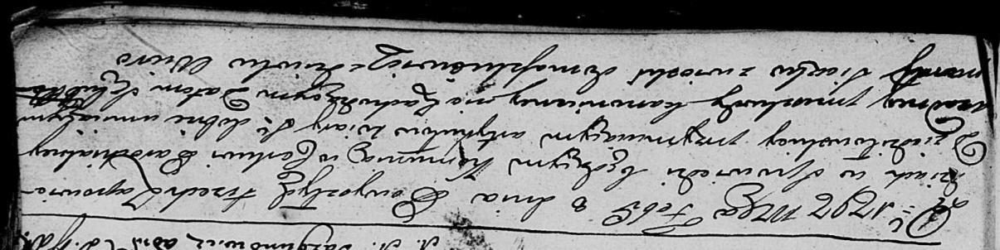
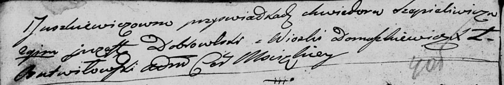
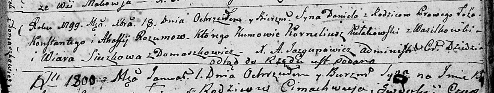
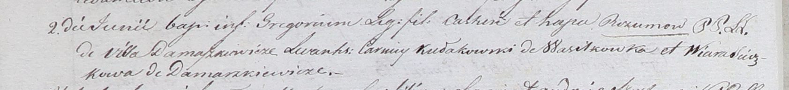

**Сечкова (Юшкевич) Вяра (Sieczkowa (Juszkiewiczowa) Wiara)**

8 февраля 1797 г -- венчание с Романом Сечко с деревни Домашковичи (НИАБ
136-13-920, лист 4-4об, №6/1797-б (ориг)).

18 декабря 1799 г -- крестная мать Даниэля, сына Розумов Кондрата и
Агафии с деревни Домашковичи (НИАБ 136-13-894, лист 40, №52/1799-р
(ориг), НИАБ 136-13-938, лист 245об, №47/1799-р (коп)).

2 июня 1801 г -- крестная мать Григора, сына Констанция и Агапы Розумов
с деревни Домашковичи (НИАБ 937-4-32, лист 4об, №12/1800-р).

**НИАБ 136-13-920:** Лист 4-4об. **Метрическая запись №6/1797-б
(ориг).**

Дедиловичская Покровская церковь. 8 февраля 1797 года. Метрическая
запись о венчании.

Siczko Roman -- жених, с деревни Домашковичи.

Juszkiewiczowna Wiera -- невеста, девка.

Szapieliwicz Chwiedor -- свидетель.

Dobrowski Justyn? -- свидетель, с деревни Домашковичи.

Butwiłowski Łukasz -- ксёндз, администратор Мстижской церкви.

**НИАБ 136-13-894:** Лист 40. **Метрическая запись №52/1799-р (ориг).**

Дедиловичская Покровская церковь. 18 декабря 1799 года. Метрическая
запись о крещении.

Rozum Daniel -- сын родителей с деревни Домашковичи.

Rozum Kondraty -- отец.

Rozumowa Ahafija -- мать.

Kułakowski Korneliusz -- кум, с деревни Васильковка.

Sieczkowa Wiara -- кума, с деревни Домашковичи.

Jazgunowicz Antoni -- ксёндз.

**НИАБ 136-13-938:** Лист 245об. **Метрическая запись №47/1799-р
(коп).**

(См. тж. НИАБ 136-13-894, лист 40, №52/1799-р (ориг); РГИА 823-2-18,
лист 273об, №51/1799-р (коп))

Дедиловичская Покровская церковь. 18 декабря 1799 года. Метрическая
запись о крещении.

Rozum Daniel Jozef -- сын родителей с деревни Домашковичи.

Rozum Konstanty \[Kondraty\] -- отец.

Rozumowa Ahafia -- мать.

Kułakowski Karniey \[Korneliusz\] -- кум, с деревни Васильковка.

Sieczkowa Wiera \[Suszkowa Wiara\] - кума, с деревни Домашковичи.

Jazgunowicz Antoni -- ксёндз.

**НИАБ 937-4-32:** Лист 4об. **Метрическая запись №12/1801-р.**

Дедиловичский костел Наисвятейшего Сердца Иисуса. 2 июня 1801 года.
Метрическая запись о крещении.

Rozum Gregori -- сын родителей с деревни Домашковичи.

Rozum Castus -- отец.

Rozumowa Hapa -- мать.

Kułakowski Carniey -- крестный отец, с деревни Васильковка.

Sieczkowa? Wiara -- крестная мать, с деревни Домашковичи.

Linhart Hyacinthus -- ксёндз.
