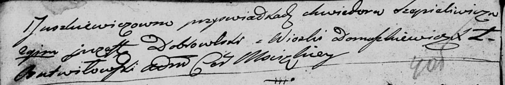

**Сечко Роман (Siczko Roman)**

8 февраля 1797 г -- венчание с Верой Юшкевич (НИАБ 136-13-920, лист
4-4об, №6/1797-б (ориг)).

**НИАБ 136-13-920:** Лист 4-4об. **Метрическая запись №6/1797-б
(ориг).**

{width="6.496527777777778in"
height="1.6279877515310586in"}

{width="6.496527777777778in"
height="1.0982884951881016in"}

Дедиловичская Покровская церковь. 8 февраля 1797 года. Метрическая
запись о венчании.

Siczko Roman -- жених, с деревни Домашковичи.

Juszkiewiczowna Wiera -- невеста, девка.

Szapieliwicz Chwiedor -- свидетель.

Dobrowski Justyn? -- свидетель, с деревни Домашковичи.

Butwiłowski Łukasz -- ксёндз, администратор Мстижской церкви.
