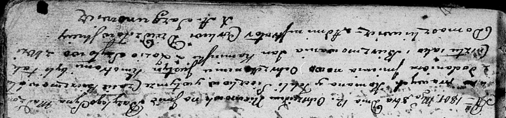

**Сечко Базыль Романов (Sieczko Bazyli Justyn)**

12 октября 1801 г -- крещение (НИАБ 136-13-894, лист 44, №23/1801-р
(ориг)).

**НИАБ 136-13-894:** Лист 44. **Метрическая запись №23/1801-р (ориг).**

Дедиловичская Покровская церковь. 12 октября 1801 года. Метрическая
запись о крещении.

Sieczko Bazyli Justyn -- сын родителей с деревни Домашковичи.

Sieczko Roman -- отец.

Sieczko Tekla -- мать.

Kaminski Jan -- кум.

Szyłowa Zosia -- кума.

Jazgunowicz Antoni -- ксёндз.
