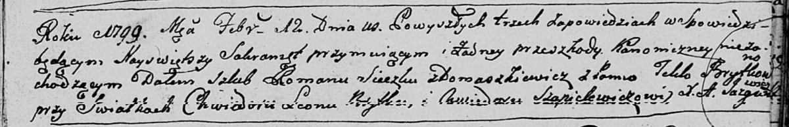
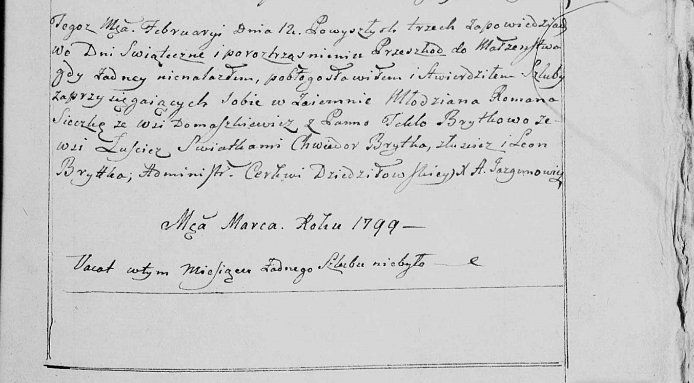

**Сечко (Брытко) Текля (Sieczkowa (Brytkowna) Tekla)**

12 февраля 1799 г -- венчание с Романом Сечко с деревни Домашковичи
(НИАБ 136-13-920, лист 6, №3/1799-б (ориг), НИАБ 136-13-938, лист 246,
№3/1799-б (коп)).

12 октября 1801 г -- крещение сына Базыля Юстына (НИАБ 136-13-894, лист
44, №23/1801-р (ориг)).

**НИАБ 136-13-920:** Лист 6. **Метрическая запись №3/1799-б (ориг).**

Дедиловичская Покровская церковь. 12 февраля 1799 года. Метрическая
запись о венчании.

Sieczko Roman -- жених, деревня Домашковичи.

Brytkowna Tekla -- невеста.

Brytka Chwiedor Leon -- свидетель.

Szapielewicz Chwiedor -- свидетель.

Jazgunowicz Antoni -- ксёндз.

**НИАБ 136-13-938:** Лист 246. **Метрическая запись №3/1799-б (коп).**

(См. тж. НИАБ 136-13-920, лист 6, №3/1799-б (ориг))

Дедиловичская Покровская церковь. 12 февраля 1799 года. Метрическая
запись о венчании.

Sieczko Roman -- жених, молодой, с деревни Домашковичи.

Brytkowa Tekla -- невеста, с деревни Лустичи.

Brytka Chwiedor -- свидетель, с деревни Горелое.

Brytka Leon \[Szapielewicz Chwiedor\] -- свидетель.

Jazgunowicz Antoni -- ксёндз.

**НИАБ 136-13-894:** Лист 44. **Метрическая запись №23/1801-р (ориг).**

Дедиловичская Покровская церковь. 12 октября 1801 года. Метрическая
запись о крещении.

Sieczko Bazyli Justyn -- сын родителей с деревни Домашковичи.

Sieczko Roman -- отец.

Sieczko Tekla -- мать.

Kaminski Jan -- кум.

Szyłowa Zosia -- кума.

Jazgunowicz Antoni -- ксёндз.
