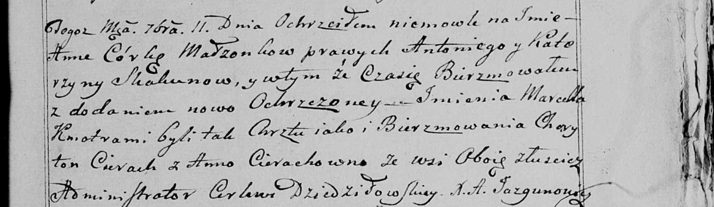

**Скакун Анна Антонова (Skakunowna Anna)**

11 сентября 1799 г -- крещение (НИАБ 136-13-894, лист 39об, №36/1796-р
(ориг), РГИА 823-2-18, лист 272, №35/1799-р (коп), НИАБ 136-13-938, лист
244, №34/1796-р (коп)).

**НИАБ 136-13-894:** Лист 39об. **Метрическая запись №36/1799-р
(ориг).**

{width="6.496527777777778in"
height="1.0138046806649168in"}

Дедиловичская Покровская церковь. 11 сентября 1799 года. Метрическая
запись о крещении.

Skakunowna Anna -- дочь родителей с деревни Домашковичи.

Skakun Antoni -- отец.

Skakunowa Katerzyna -- мать.

Cierach Charyton -- кум, с деревни Лустичи.

Cierachowa Anna -- кума.

Jazgunowicz Antoni -- ксёндз.

**РГИА 823-2-18:** Лист 272. **Метрическая запись №35/1799-р (коп).**

{width="6.496527777777778in"
height="2.079861111111111in"}

Дедиловичская Покровская церковь. 11 сентября 1799 года. Метрическая
запись о крещении.

Skakunowna Anna -- дочь родителей с деревни \[Домашковичи\].

Skakun Antoni -- отец.

Skakunowa Katerzyna -- мать.

Skakun Klamiata \[Cierach Charyton\] -- кум, с деревни Осово.

Cierachowa Anna -- кума.

Jazgunowicz Antoni -- ксёндз.

**НИАБ 136-13-938:** Лист 244. **Метрическая запись №34/1799-р (коп).**

(См. тж. НИАБ 136-13-894, лист 39об, №36/1799-р (ориг); РГИА 823-2-18,
лист 271, №33/1799-р (коп))

{width="6.496527777777778in"
height="1.886111111111111in"}

Дедиловичская Покровская церковь. 11 сентября 1799 года. Метрическая
запись о крещении.

Skakunowna Anna Marcella -- дочь родителей с деревни \[Домашковичи\].

Skakun Antoni -- отец.

Skakunowa Katerzyna -- мать.

Cierach Charyton -- кум, с деревни Лустичи.

Cierachowna Anna - кума, с деревни Лустичи.

Jazgunowicz Antoni -- ксёндз.
