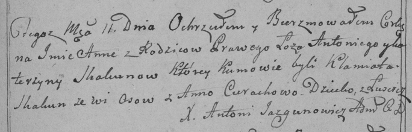

**Скакун Ева Антонова (Skakunowna Ewa)**

27 февраля 1793 г -- крещение (НИАБ 136-13-894, лист 19, №26/1793-р
(ориг)).

**НИАБ 136-13-894:** Лист 19. **Метрическая запись №26/1793-р (ориг).**

{width="6.496527777777778in"
height="0.9695505249343832in"}

Дедиловичская Покровская церковь. 27 февраля 1793 года. Метрическая
запись о крещении.

Skakunowna Ewa -- дочь родителей с деревни Домашковичи.

Skakun Anton -- отец.

Skakunowa Katerzyna -- мать.

Cierach Haryton - кум.

Cierachowa Anna - кума.

Jazgunowicz Antoni -- ксёндз.
