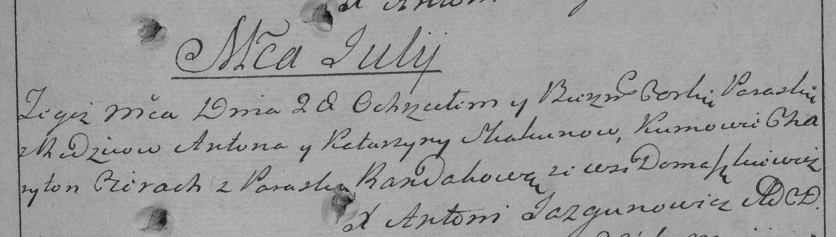

**Скакун Параска Антонова (Skakunowna Paraska)**

28 июля 1790 г -- крещение (НИАБ 136-13-894, лист 10об, №53/1790-р
(ориг)), (РГИА 823-2-18, лист 240, №19/1790-р (коп)).

**НИАБ 136-13-894:** Лист 10об. **Метрическая запись №53/1790-р
(ориг).**

{width="6.496527777777778in"
height="0.889760498687664in"}

Дедиловичская Покровская церковь. 28? июля 1790 года. Метрическая запись
о крещении.

Skakunowna Paraska -- дочь родителей с деревни Домашковичи.

Skakun Anton -- отец.

Skakunowa Katerzyna -- мать.

Cierach Charyton - кум.

Randakowa Paraska - кума.

Jazgunowicz Antoni -- ксёндз.

**РГИА 823-2-18:** Лист 240. **Метрическая запись №19/1790-р (коп).**

{width="6.496527777777778in"
height="1.8416666666666666in"}

Дедиловичская Покровская церковь. 28 июля 1790 года. Метрическая запись
о крещении.

Skakunowna Paraska -- дочь родителей с деревни Домашковичи.

Skakun Anton -- отец.

Skakunowa Katarzyna -- мать.

Cierach Charyton -- кум.

Randakowa Paraska - кума.

Jazgunowicz Antoni -- ксёндз.
