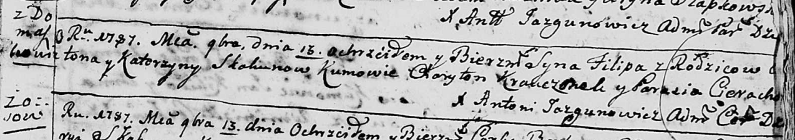

**Скакун Филипп Антонов (Skakun Filip)**

16 ноября 1787 г -- крещение (НИАБ 136-13-894, лист 3, №58/1787-р
(ориг)).

**НИАБ 136-13-894:** Лист 3. **Метрическая запись №58/1787-р (ориг).**

Дедиловичская Покровская церковь. 16 ноября 1787 года. Метрическая
запись о крещении.

Skakun Filip -- сын родителей с деревни Домашковичи.

Skakun Anton -- отец.

Skakunowa Katerzyna -- мать.

Krauczonek Charyton - кум.

Cierachowa Parasia - кума.

Jazgunowicz Antoni -- ксёндз.
