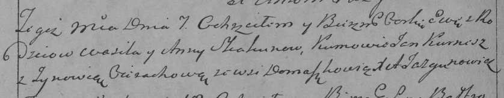

**Скакун Ева Василева (Skakunowna Ewa)**

7 февраля 1793 г -- крещение (НИАБ 136-13-894, лист 18об, №16/1793-р
(ориг)), (РГИА 823-2-18, лист 246, №6/1793-р (коп)).

**НИАБ 136-13-894:** Лист 18-об. **Метрическая запись №16/1793-р
(ориг).**

Дедиловичская Покровская церковь. 7 февраля 1793 года. Метрическая
запись о крещении.

Skakunowna Ewa -- дочь родителей с деревни Домашковичи.

Skakun Wasil -- отец.

Skakunowa Anna -- мать.

Kurnesz Janka - кум.

Cierachowa Zynowija - кума.

Jazgunowicz Antoni -- ксёндз.

**РГИА 823-2-18:** Лист 246об. **Метрическая запись №6/1793-р (коп).**

Дедиловичская Покровская церковь. 7 февраля 1793 года. Метрическая
запись о крещении.

Skakunowna Ewa -- дочь родителей с деревни Домашковичи.

Skakun Wasil -- отец.

Skakunowa Anna -- мать.

Kurnesz Jan -- кум.

Cierachowa Zynowia -- кума.

Jazgunowicz Antoni -- ксёндз.
