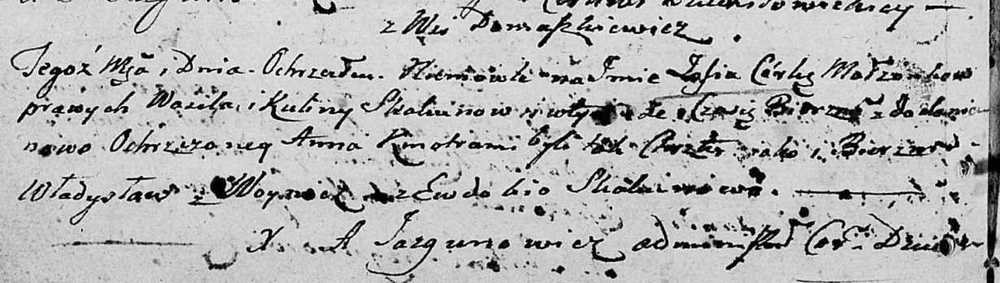

**Скакун Василь (Skakun Wasil)**

26 сентября 1803 г -- крещение дочери Зофии Анны (НИАБ 136-13-894, лист
51об, №38/1803-р (ориг)).

**НИАБ 136-13-894:** Лист 51об. **Метрическая запись №38/1803-р
(ориг).**

Дедиловичская Покровская церковь. 26 сентября 1803 года. Метрическая
запись о крещении.

Skakunowna Zofia Anna -- дочь родителей с деревни Домашковичи.

Skakun Wasil -- отец.

Skakunowa Kulina -- мать.

Woynicz Władysław -- кум.

Skakunowa Ewdokija -- кума.

Jazgunowicz Antoni -- ксёндз.
