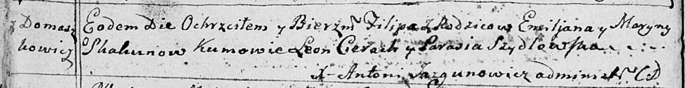

**Скакун Марына (Skakunowa Maryna)**

16 ноября 1791 г -- крещение сына Филиппа (НИАБ 136-13-894, лист 14об,
№59/1791-р (ориг)).

**НИАБ 136-13-894:** Лист 14-об. **Метрическая запись №59/1791-р
(ориг).**

Дедиловичская Покровская церковь. 16 ноября 1791 года. Метрическая
запись о крещении.

Skakun Filip -- сын родителей с деревни Домашковичи.

Skakun Emiljan -- отец.

Skakunowa Maryna -- мать.

Cierach Leon - кум.

Szydłowska Parasia - кума.

Jazgunowicz Antoni -- ксёндз.
