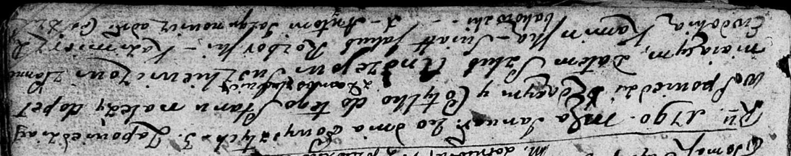

**Сушкевич (Каминская) Евдокия (Suszkiewiczowa Ewdokija z Kaminskich)**

20 января 1790 г -- венчание с Андреем Сушкевичем с деревни Домашковичи
(НИАБ 136-13-894, лист 68, №2/1790-б (ориг)).

**НИАБ 136-13-894:** Лист 68. **Метрическая запись №2/1790-б (ориг).**

Дедиловичская Покровская церковь. 20 января 1790 года. Метрическая
запись о венчании.

Suszkiewicz Andrzey -- жених, с деревни Домашковичи.

Kaminska Ewdokija -- невеста.

Rozborski Jakub -- свидетель.

Rybakowski? Kazimierz -- свидетель.

Jazgunowicz Antoni -- ксёндз.
