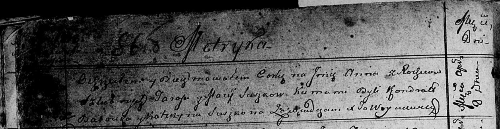

**Сушко Анна Тарасова (Suszkowna Anna)**

8 апреля 1813 г -- крещение (НИАБ 136-13-894, лист 86об, №8/1813-р
(ориг)).

**НИАБ 136-13-894:** Лист 86об. **Метрическая запись №8/1813-р (ориг).**

Осовская Покровская церковь. 8 апреля 1813 года. Метрическая запись о
крещении.

Suszkowna Anna -- дочь родителей с деревни \[Домашковичи\].

Suszko Taras -- отец.

Suszkowa Marija -- мать.

Babowka Kandrat -- кум.

Suszkowa Katerzyna -- кума.

Woyniewicz Tomasz -- ксёндз.
