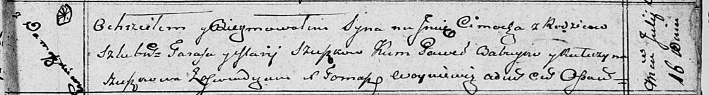
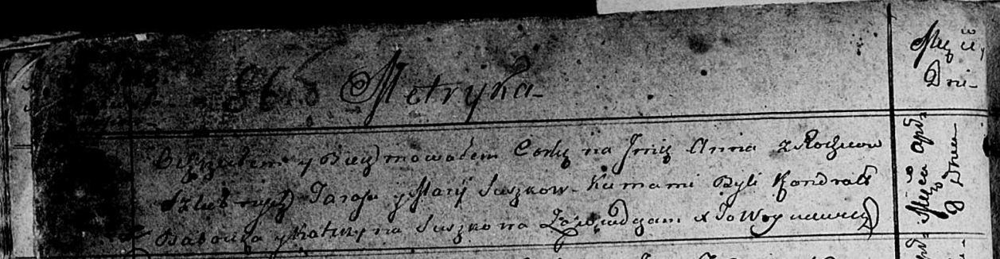

**Сушко Тарас (Suszko Taras)**

16 июля 1810 г -- крещение сына Цимоха (НИАБ 136-13-894, лист 78,
№28/1810-р (ориг)).

8 апреля 1813 г -- крещение дочери Анны (НИАБ 136-13-894, лист 86об,
№8/1813-р (ориг)).

**НИАБ 136-13-894:** Лист 78. **Метрическая запись №28/1810-р (ориг).**

Осовская Покровская церковь. 16 июля 1810 года. Метрическая запись о
крещении.

Szuszko Cimoch -- сын родителей с деревни Домашковичи.

Szuszko Taras -- отец.

Szuszkowa Marija -- мать.

Ba..yew Paweł -- кум.

Szuszkowa Katerzyna -- кума.

Woyniewicz Tomasz -- ксёндз.

**НИАБ 136-13-894:** Лист 86об. **Метрическая запись №8/1813-р (ориг).**

Осовская Покровская церковь. 8 апреля 1813 года. Метрическая запись о
крещении.

Suszkowna Anna -- дочь родителей с деревни \[Домашковичи\].

Suszko Taras -- отец.

Suszkowa Marija -- мать.

Babowka Kandrat -- кум.

Suszkowa Katerzyna -- кума.

Woyniewicz Tomasz -- ксёндз.
