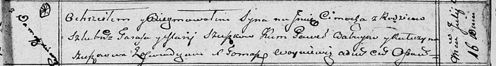

**Сушко Цимох Тарасов (Suszko Cimoch)**

16 июля 1810 г -- крещение (НИАБ 136-13-894, лист 78, №28/1810-р
(ориг)).

**НИАБ 136-13-894:** Лист 78. **Метрическая запись №28/1810-р (ориг).**

{width="6.496527777777778in"
height="0.876350612423447in"}

Осовская Покровская церковь. 16 июля 1810 года. Метрическая запись о
крещении.

Szuszko Cimoch -- сын родителей с деревни Домашковичи.

Szuszko Taras -- отец.

Szuszkowa Marija -- мать.

Ba..yew Paweł -- кум.

Szuszkowa Katerzyna -- кума.

Woyniewicz Tomasz -- ксёндз.
