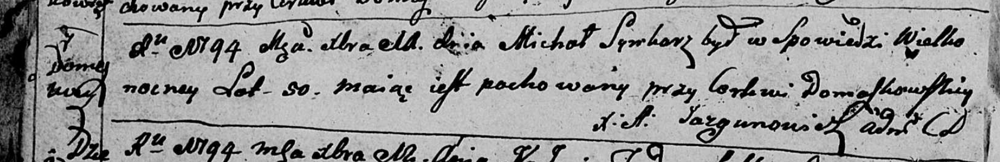

**Сывкор Михал (Sywkorz Mihał)**

11 декабря 1794 г -- отпевание, умер в возрасте 50 лет (родился около
1744 г) (НИАБ 136-13-919, лист 3об, №65/1794-у)).

**НИАБ 136-13-919:** Лист 3об. **Метрическая запись №65/1794-у (ориг).**

{width="6.496527777777778in"
height="1.0555555555555556in"}

Дедиловичская Покровская церковь. 11 декабря 1794 года. Метрическая
запись об отпевании.

Sywkorz Michał -- умерший, 50 лет, с деревни Домашковичи, похоронен на
кладбище при церкви Домашковичской.

Jazgunowicz Antoni -- ксёндз.
