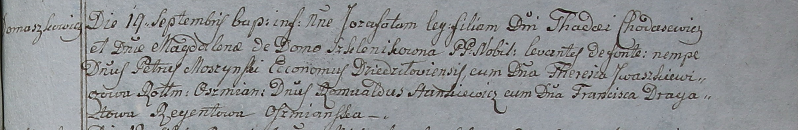

**Ходасевич Магдалена (Шкленик) (Chodasewiczowa Magdalena z
Szklenikow)**

19 сентября 1798 г -- крещение сына Иозафата (НИАБ 1781-27-199, лист
123, №9/1798-р).

6 мая 1800 г -- крещение сына Петра (НИАБ 937-4-32, лист 2, №14/1800-р).

**НИАБ 1781-27-199:** Лист 123. **Метрическая запись №9/1798-р.**

Дедиловичский костел Наисвятейшего Сердца Иисуса. 19 сентября 1798 года.
Метрическая запись о крещении.

Chodasewicz Jozafat -- сын шляхтичей с деревни Домашковичи.

Chodasewicz Thadei -- отец.

Chodasewiczowa Magdalena z Szklenikow? -- мать.

Moszynski Petrus -- крестный отец, эконом Дедиловичский.

Jwaszkiewiczowa Teresia - крестная мать, ротмистрова Ошмянского.

Stankiewicz Romualdus -- крестный отец.

Dragatowa Francisca -- крестная мать, регентова Ошмянского.

Linhart Hyacinthus -- ксёндз.

**НИАБ 937-4-32:** Лист 2. **Метрическая запись №14/1800-р.**

Дедиловичский костел Наисвятейшего Сердца Иисуса. 6 мая 1800 года.
Метрическая запись о крещении.

Chodasewicz Petrus -- сын шляхтичей с двора Домашковичи.

Chodasewicz Thadei -- отец, эконом двора Домашковичи.

Chodasewiczowa Magdalena -- мать.

Stankiewicz Romuald -- крестный отец, шляхтич с двора Дедиловичи.

Czarnocka Victoria -- крестная мать, шляхтянка, жена ротмистра
Стародубского.

Bujewicz Michael -- ассистент, шляхтич.

Sabiłowa Francisca -- ассистентка, шляхтянка, с деревни Отруб.

Linhart Hyacinthus -- ксёндз.
