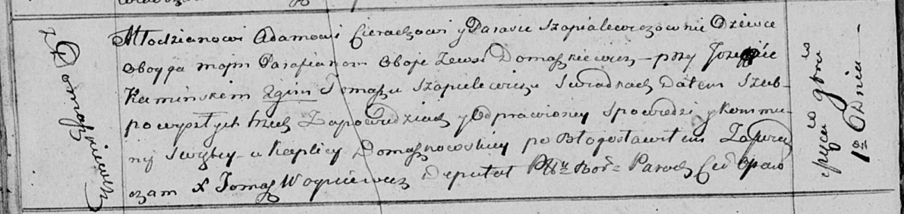

**Церах (в девичестве Шапелевич) Параска (Cierachowa Paraska z
Szapialewiczow)**

1 сентября 1814 г -- венчание с молодым Адамом Церахом с деревни
Домашковичи (НИАБ 136-13-920, лист 21об, №10/1814-б)).

**НИАБ 136-13-920:** Лист 21об. **Метрическая запись №10/1814-б
(ориг).**

{width="6.496527777777778in"
height="1.543503937007874in"}

Осовская Покровская церковь, каплица Домашковичская. 1 сентября 1814
года. Запись о венчании.

Cierach Adam -- жених, молодой, парафии Осовской, с деревни Домашковичи.

Szapialewiczowna Paraska -- невеста, девка, парафии Осовской, с деревни
Домашковичи.

Kaminski Jozef -- свидетель.

Szapielewicz Tomasz -- свидетель.

Woyniewicz Tomasz -- ксёндз.
