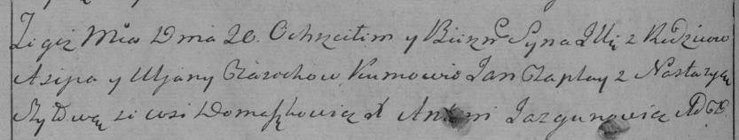

**Церах Ульяна (Cierachowa Ullana)**

20 июля 1796 г -- крещение сына Ильи НИАБ 136-13-894, лист 30,
№67/1796-р (ориг), (РГИА 823-2-18, лист 256об, №38/1796-р (коп)).

**НИАБ 136-13-894:** Лист 30. **Метрическая запись №67/1796-р (ориг).**

Дедиловичская Покровская церковь. 20 июля 1796 года. Метрическая запись
о крещении.

Cierach Jlla -- сын родителей с деревни Домашковичи.

Cierach Asip -- отец.

Cierachowa Ullana -- мать.

Czaplay Jan - кум.

Szyłowa Nastazyia - кума.

Jazgunowicz Antoni -- ксёндз.

**РГИА 823-2-18:** Лист 256об. **Метрическая запись №38/1796-р (коп).**

Дедиловичская Покровская церковь. 20 июля 1796 года. Метрическая запись
о крещении.

Cieroch Jlla -- сын родителей с деревни Домашковичи.

Cieroch Asip -- отец.

Cierochowa Uljana -- мать.

Czaplay Jan -- кум.

Szyłowa Nastazya -- кума.

Jazgunowicz Antoni -- ксёндз.
