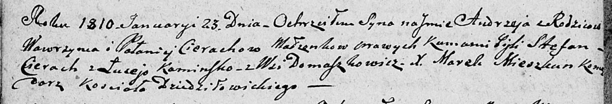

**Церах Вавжыний (Cierach Wawrzyni)**

23 января 1810 г -- крещение сына Андрея (НИАБ 136-13-894, лист 76об,
№3/1810-р (ориг)).

**НИАБ 136-13-894:** Лист 76об. **Метрическая запись №3/1810-р (ориг).**

{width="6.496527777777778in"
height="1.106334208223972in"}

Дедиловичская Покровская церковь. 23 января 1810 года. Метрическая
запись о крещении.

Cierach Andrzey -- сын родителей из деревни Домашковичи.

Cierach Wawrzyni -- отец.

Cierachowa Pałanieja -- мать.

Cierach Stefan -- кум.

Kaminska Luceja -- кума.

Mieszkun Marek -- ксёндз, комендант Дедиловичского костела.
