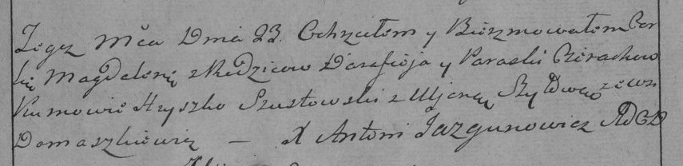

**Церах Магдалена Дарафеева (Cierachowna Magdalena)**

23 августа 1786 г -- крещение (РГИА 823-2-18, лист 232, №21/1786-р
(коп)).

**РГИА 832-2-18:** Лист 232. **Метрическая запись №21/1786-р (коп).**

{width="6.496527777777778in"
height="1.5805555555555555in"}

Дедиловичская Покровская церковь. 23 августа 1786 года. Метрическая
запись о крещении.

Cierachowna Magdalena -- дочь родителей с деревни Домашковичи.

Cierach Darafiey -- отец.

Cierachowa Paraska -- мать.

Szustowski Hryszko -- кум.

Szyłowa Uljana - кума.

Jazgunowicz Antoni -- ксёндз.
